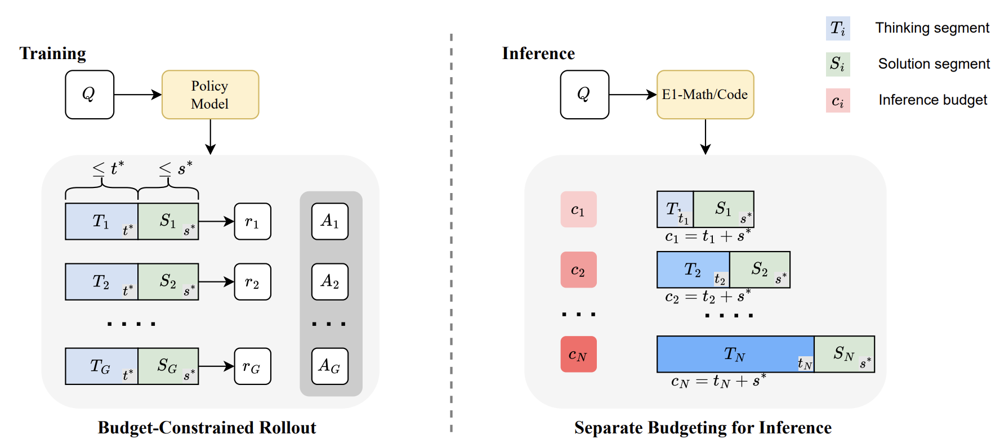
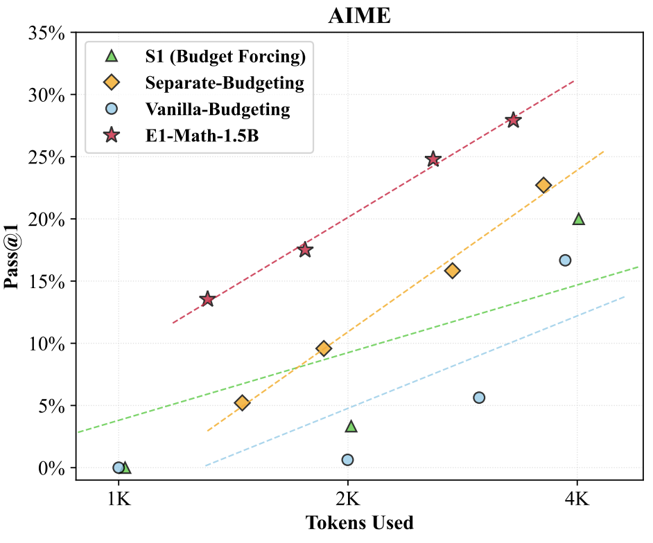
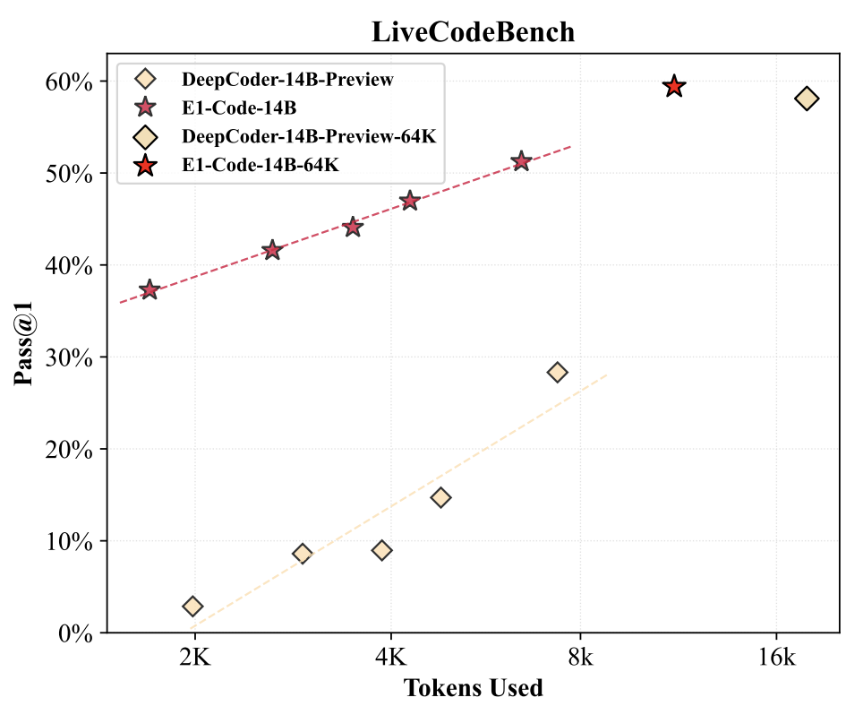
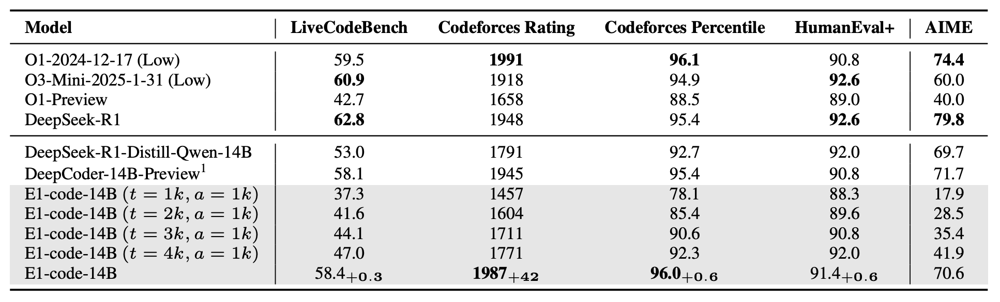

<div align="center">

# Elastic Reasoning
<div>
<div>
<h3>🚀 Scalable Chain of Thoughts via Elastic Reasoning 🌟
</div>
</div>
<br>
<div align="center">

[](https://arxiv.org/pdf/2505.05315)
[](https://huggingface.co/collections/Salesforce/elastic-reasoning-682b4bba108d6ea0a8bab275)
[](https://github.com/SalesforceAIResearch/Elastic-Reasoning)

</div>
</div>


## Table of Contents
- [Introduction](#introduction)
- [Environment Setup](#environment-setup)
- [Training](#training)
- [Evaluation](#evaluation)

## Introduction
We propose **Elastic Reasoning**, a novel framework for scalable chain of thoughts
that explicitly separates reasoning into two phases—`thinking and solution`—with
independently allocated budgets. At test time, Elastic Reasoning prioritize that
completeness of solution segments, significantly improving reliability under tight
resource constraints. To train models that are robust to truncated thinking, we
introduce a lightweight `budget-constrained rollout` strategy, integrated into GRPO,
which teaches the model to reason adaptively when the thinking process is cut
short and generalizes effectively to unseen budget constraints without additional
training. 
<p align="center">
  
</p>


**Main Takeaways**
1. ✂️ Thinking + Solution are explicitly separated with independent budgets — boosting reliability under tight compute constraints.
2. 🧠 Budget-Constrained Rollout: We train models to handle truncated reasoning using GRPO.
3. 📈 Flexible scalability: Robust performance across diverse inference budgets on reasoning benchmarks like AIME and LiveCodeBench.
4. ⚙️ Better performance with fewer tokens: Our trained model generates outputs that are 30% shorter while maintaining (or even improving) accuracy.

<p align="center">
  
    
</p>

<p align="center">
  
</p>

## Environment Setup


### Installation
```bash
# Installing Python 3.10 Environment.
conda create -n e1 python=3.10 -y
conda activate e1

# Installing dependencies.
cd Elastic-Reasoning
pip install -e ./verl
pip install -e .
```
### Data
Our raw training data is in `rllm/data/[train|test]/[code|math]/`, along with preprocessing scripts in `rllm/data/preprocess`. To convert the raw data into Parquet files for training, run:

```bash
# Download datasets from GDrive, populates rllm/data/[train|test]/[math|code]/*.json
python scripts/data/download_datasets.py

# Generate parquet files for Deepcoder/DeepscaleR in data/*.parquet
python scripts/data/[deepcoder|deepscaler]_dataset.py
```
## Training
```bash
export MODEL_PATH="agentica-org/DeepScaleR-1.5B-Preview"
./scripts/e1-math/e1_math_1.5b_1k_1k.sh --model $MODEL_PATH
```

## Evaluation

To run our evaluation scripts, run:
```bash
./scripts/eval/eval_model.sh --model [CHECKPOINT_PATH] --datasets [DATASET1] [DATASET2] --output-dir [OUTPUT_DIR] --n [N_PASSES] --tp [TENSOR_PARALLEL_SIZE] --e1-mode [SEPARATE_BUDGETING] --e1-thinking-length [THINKING_LENGTH] --e1-solution-length [SOLUTION_LENGTH]
```

### Example on MATH
```bash
./scripts/eval/eval_model.sh --model Salesforce/E1-Math-1.5B --datasets aime math amc minerva olympiad_bench --output-dir $HOME/E1-Math-1.5B --tp 1 --n 16 --e1-mode True --e1-thinking-length 1024 --e1-solution-length 1024
```
### Example on LiveCodeBench
```bash
./scripts/eval/eval_model.sh --model Salesforce/E1-Code-14B--datasets test_livecodebench --output-dir $HOME/E1-Code-14B --tp 4 --e1-mode True --e1-thinking-length 1024 --e1-solution-length 1024
```

### Example on Codeforces
```bash
./scripts/eval/eval_model.sh --model Salesforce/E1-Code-14B --datasets test_codeforces --output-dir $HOME/DeepCoder-14B-Preview --tp 4 --n 8 --e1-mode True --e1-thinking-length 1024 --e1-solution-length 1024
```
```bash
python scripts/deepcoder/benchmark/cf_elo_calc.py --results_path [RESULTS_JSON_PATH] --pass_n 8
```

## Acknowledgement
We greatly thanks [rllm](https://github.com/agentica-project/rllm) and [verl](https://github.com/volcengine/verl) for providing the awesome codebase!

## Citation


```bibtex
@article{xu2025scalable,
  title={Scalable Chain of Thoughts via Elastic Reasoning},
  author={Xu, Yuhui and Dong, Hanze and Wang, Lei and Sahoo, Doyen and Li, Junnan and Xiong, Caiming},
  journal={arXiv preprint arXiv:2505.05315},
  year={2025}
}
```

## Ethical Considerations
This release is for research purposes only in support of an academic paper. Our models, datasets, and code are not specifically designed or evaluated for all downstream purposes. We strongly recommend users evaluate and address potential concerns related to accuracy, safety, and fairness before deploying this model. We encourage users to consider the common limitations of AI, comply with applicable laws, and leverage best practices when selecting use cases, particularly for high-risk scenarios where errors or misuse could significantly impact people’s lives, rights, or safety. For further guidance on use cases, refer to our AUP and AI AUP.